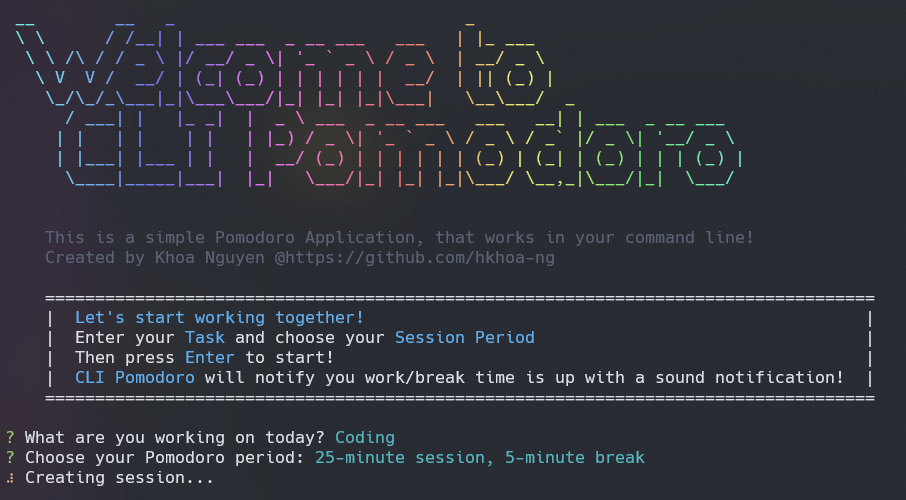
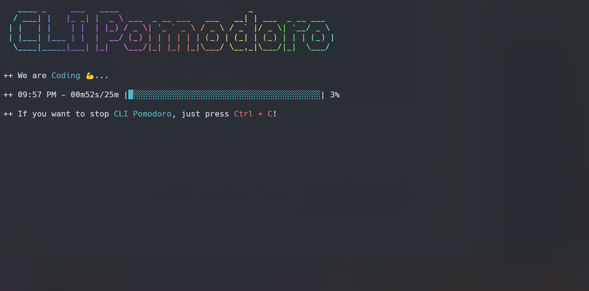

# [CLI Pomodoro](https://www.npmjs.com/package/cli-pomodoro)

A simple,  cross-platform [Pomodoro](https://en.wikipedia.org/wiki/Pomodoro_Technique)-like application that runs in your terminal! Requires [Node.js version 14 and up](https://nodejs.org/en/) to work.

---
## Quick start

1. You must have `Node.js` version 14 and up to be able to use this app. Install `Node.js` using [installer for your platform](https://nodejs.org/en/download/).
2. Check that you have `Node.js` installed, along with `npx` by using the following command in your terminal:
    ```
    node -v
    npx -v
    ```
    These commands should show the current version of Node.js and npm installed e.g., 
    ```
    node -v
    v18.13.0
    ```
3. Install the application with:
    ```
    npx cli-pomodoro
    ```
4. After installation, restart the terminal and run this command again:
    ```
    npx cli-pomodoro
    ```
    The app should be working properly with audio now! Happy Pomodoro!

---
## Using the Application from source code
1. Again, you must have `Node.js` version 14 and up to be able to use this app. Install `Node.js` using [installer for your platform](https://nodejs.org/en/download/).
2. Clone the repository:
    ```
    git clone https://github.com/hkhoa-ng/cli-pomodoro.git
    ```
3. Go in to that folder:
    ```
    cd cli-pomodoro
    ```
4. Install the required dependencies:
   ```
   npm install
   ```
5. Run the application on your terminal:
   ```
   node ./index.js
   ```
    The application should be running fine in your terminal. If any errors surface, try to stop the process, restart the terminal, and run `node ./index.js` in your terminal again.

---
## Application interface

Some screenshot of the application working...




---

Feel free to edit the source code to your liking! This is just a fun little project I did in my free time!
